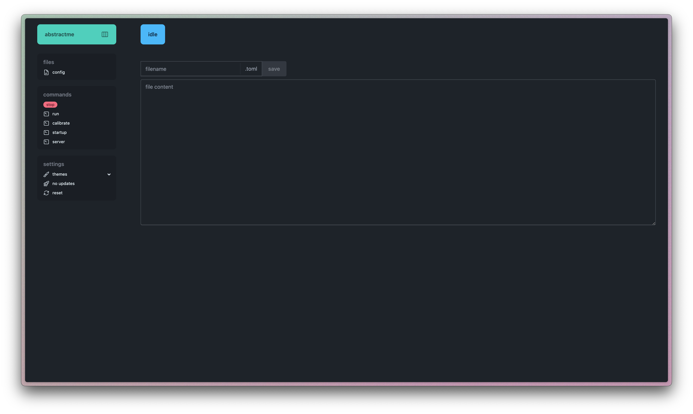

# raspberry

this is the code related to the data acquisition for the force-torque sensor and the tactile sensor

## usage

the code for acquiring the sensor's data is written in [the go programming language](https://go.dev/), which i know it is not a very well-known programming language. although you could leran it in one afternoon and i think it should be used always in robotics...

### simplified usage

if you don't want to know anything about how it is programmed, i have created a webapp to run the data acquisition program. when you connect the raspberry to power it will show the ip it is connected to. go to a browser and enter the ip + `:8080` (e.g. `145.94.60.82:8080`). there you will see this:

<div align="center">

</div>

if you click th `config` file you can modisy all the settings of the program. the most important ones are:

- `execution_time`, where you specify how long do you want the program to run
- `ip`, the ip of the computer to which the data will be sent to

then, you click on `run` and wait few seconds for the sensor to setup and calibrate.

to receive the data, you need a server running in your computer in the `ip` you specified. you have some options here:

- ask chatgpt to program a udp server, which is just a few lines of code
- check out the [server code i did](https://github.com/vistormu/tactileforce/blob/main/desktop/src/server.py) for the online learning applicaton
- use [udp2plot](https://github.com/vistormu/udp2plot), which is a simple python tool i created for receiving data from udp and plotting it on real time

### adavanced usage

you need to `ssh` into the raspberry with the ip that is displayed in the oled panel. for example:

```shell
ssh raspberry@145.94.60.82
```

where the password is `raspberry`.

go to the project's root dir:

```shell
cd projects/tactileforce/raspberry
```

in a terminal, use:

```shell
sudo go run main.go <command>
```

where command can be either:
- `run`: runs the data acquisition program
- `calibrate`: sends the raw value of the sensor so you can adjust the potentiometer of the tactile sensor

also, i created a `makefile` to run these commands for you, so you could use `make run` or `make calibrate`.

---

# additional information

below i will explain in more detail all the parts of the code

## code explanation

### commands

the entry point of the program is `main.go`, which redirects the execution of the program to `commands/commands.go`. there, depending on the command provided, the program runs `commands/run.go` or `commands/calibrate.go`.

### main program

the `run.go` file is the most important one. it reads the configuration file, sets up the sensors and filetrs, and reads and sends the data in the loop.

if you want to send more data via udp, add it to the `data` map in line `165`.

### sensors

the code for the sensors is under the `sensors` dir. for the communications i use:
- [go-serial](https://github.com/bugst/go-serial) for serial communication
- [go-berry](https://github.com/vistormu/go-berry) for i2c, udp and spi

### config
the configuration file of the program is `configs/config.toml`. there you can modify all the parameters of the program

`[simulation]`:
- `execution_time`: the time in seconds the program will run
- `dt`: the timestep in seconds
- `calibration_time`: the time in seconds spent in calibrating the sensors
- `calibration_trim`: the percentage of initial values to trim from the calibartion (usually the first values are not representative)

`[client]`:
- `ip`: the ip of the computer to send the data via udp
- `port`: the port of the connexion

`[bota_sensor]`
- `port`: the location of the usb port

`[bota_sensor.mf]`
- `window`: the window of the median filter
- `post_window`: the window of the median filter used after the kalman filter

`[bota_sensor.kf]`
- `process_variance`: the process variance
- `measurement_variance`: the measurement variance
- `initial_error_covariance`: the initial error covariance

`[tactile_sensor]`
- `v_ref`: the voltage reference
- `chip_select`: the chip select gpio number of the ADC
- `led_on_off`: the gpio pin to swicth the LEDs on and off

### show ip and start server on boot

the `startup/startup.sh` script is the one that shows the ip on the oled screen and starts the server

to execute a shell script at the startup you have to follow these steps:

```
chmod +x startup/startup.sh
crontab -e
```

and add the following line

```
@reboot /home/raspberry/projects/tactileforce/raspberry/startup/startup.sh >> /home/raspberry/projects/tactileforce/raspberry/startup/startup.log 2>&1
```

## force-torque sensor

the torque-force sensor used is a [SensOne](https://www.botasys.com/force-torque-sensors/sensone) sensor from Bota systems. the communication is done via the serial port through a USB connection. the information on how to use it is on [the repo we created](https://github.com/tud-phi/bota_ft_sensors) for the lab.

for this application the sensor's data is filtered using a median filter and a Kalman filter at all times. before the program begins, there is one second of calibration, which is used to get the mean value of the initial reading. this initial reading is then substracted to each reading to get the relative change in force and torque.

also, a transformation of -45 degrees along the z-axis of the sensor is applied to align it with the wrist.

## tactile sensor

the tactile sensor is made in-house, so when the paper is published i will link it here.

## connections

below you can see a photo of the connections

<div align="center">

</div>

### tactile sensor

- `red`: 3.3V
- `black`: gnd
- `brown`: sensor 1 voltage
- `purple`: sensor 2 voltage
- `yellow`: sensor 3 voltage
- `green`: sensor 4 voltage
- `blue`: potentiometer (0-2000 Ohm)
- `orange`: led on-off

## installation from scratch on a raspberry pi

### enable interfaces

### install go

```
ln -s go TMP
```
